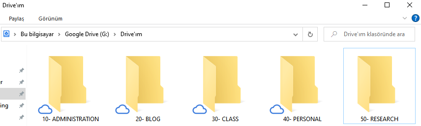

Uzun zamandır kendime bir bilgi yönetim sistemi yapmak istiyordum. Daha önce kullandığım Notion uygulamasında yer yer sorunlar yaşadım. Örneğin, Notion’da görseller Amazon Cloud sisteminde saklandığı için Notion ile metni dışarı aktardığımda görseller istediğim gibi gelmiyordu. Kopyalanan link olarak geliyordu. Yada Notion uygulamasının klasörleme veya kategorizasyon sistemine tam uyan bir yapısı olmadığı için yine istediğim özelliklere sahip olmadığını düşündüm. Başlamadan önce bu yöntemin özellikleri şu şekilde verilebilir;

-   Bilgileri pratik bir şekilde saklamalı ve almalı
-   Yormaması, anlaşılabilir ve sürekli düzenlenebilir olması gerekiyor.
-   Var olan sistemlerle uyumlu olmalı.
-   Markdown okumaya ve yazmaya izin vermeli
-   Hızlı ve gelişmiş arama sistemine sahip olmalı

Bu özelliklere sahip sistemlerden birisi [Johnny•Decimal](https://johnnydecimal.com/) sistemi. Bu sistemin prensipleri şu şekilde verilebilir:

1.  Maksimum 10 adet alan veya kategori olmalı.
2.  Kategori dışında tekil bir şey dosya gibi olmamalı.
3.  2’den fazla alt klasöre izin yok.
4.  2 tık ile en derin klasöre ulaşmak gerekiyor.
5.  Acele etmeden en az 1 gün üzerinde düşünülmelidir.
6.  Olabildiğince az alan ve kategori ile çalışın.

Nedenleri;

-   Aradığınızı daha hızlı bulabilmek
-   Zihin ve çalışma kargaşasından kurtulmak ve daha düzenli çalışmak
-   Farklı uygulamalarda benzer yapıyı oluşturarak uygulamaları daha verimli kullanmak

Nasıl uygulanır?

1.  Tüm sisteminizi en fazla 10 parçaya bölecek alanlar belirleyin. 10-19–> Birinci alan, 20-29–> ikinci alan gibi.
2.  Her alanda en fazla 10 parça ya da kategori çıkarın. Örneğin, birinci alanın birinci parçası 11, ikinci alanın üçüncü parçası 23 gibi.
3.  Kategori içerisindeki herbir dosyayı ya da klasörü numaralandırın. 01, 09, 68 gibi. Örneğin, ikinci alanın üçüncü kategorisinin beşinci elemanı 23.05 olur. 23.05 o elemanın ID numarasıdır. Bu şekilde çağrılacaktır.
4.  Kurguladığınız yapıyı mail, not alma, klasörleme, uygulama geliştirme gibi diğer ortamlarda da kullanın.

## Notların Johnny•Decimal’a Uyarlanması için Adımlar

- Tüm notlarınızı(Onenote, Google Keep, Notion, Evernote vb.) birlikte gözden geçirin. Notlarınızı bir liste yapın. Notların başlıklarını ve içeriklerini inceleyin.
- Notlarınızın alanlarını üst kategorilerini beyin fırtınası yaparak belirleyin. Notlarınız hangi alanlarda yoğunlaşmış? Örneğin, idari, akademik, kişisel üst kategorileri akademik personel için oluşturulabilir. Ya da işletmeler için Finans, pazarlama, satış gibi departman isimleri bir üst kategori olabilir.
- Üst kategorilere numara verin. Herhangi bir sıra ile verebilirsiniz, isim sırası şart değil. Hatta isim sırası olmazsa daha iyi olur. Çünkü araya bir isim geldiğinde isim sıralaması değişecektir. Bu numaralar o alana özel tanımlanmış bir ID numarası sadece. Büyüklük ya da önem ifade etmeyecek.
- Alanlara ait en fazla 10 tane kategori belirleyin. Bunlara da Alan numarasını devam ettirecek şekilde ID verin. 11-23-44- gibi numaralar olabilir. Örneğin research kategorisine ait bildiri, makale, kitap bölümü gibi kategoriler olabilir. Bunlara verilecek numaralar da aynı şekilde harf sırası olabilir de olmayabilir de.
- Artık kategorilerin içerisine çalışma klasörlerinizi koyabilirsiniz. Herbir klasör burada 01den başlayacak şekilde numara alacak. 99 a kadar içerisine tanımlama yapılabilir. 99’un üzerine çıkarsa? Çıkmayacaktır ancak çıkarsa artık kategorinizi bölmenin zamanı gelmiş demektir. Arşiv klasörü oluşturabilirsiniz. Ya da bir şekilde bu problemi çözebilirsiniz. Kategorilere örnek olarak research altında bildiri altında 01 ID numaralı öğe 53.01 verilebilir. Elde edilen ID numarası tam sayı kısmı ve desimal kısmı olarak ikiye ayrılıyor. Tam sayı. decimal ile dokümanlarınızı arayabilirsiniz. Başka uygulamalarda da bu yapıyı kullanarak hızlı bir şekilde aradığınızı bulabilirsiniz.

Bu anlatımı yaptığım [videoyu](https://www.youtube.com/watch?v=w8v-kkbe1xI) izleyebilirsiniz.

## Sonuç Ekran Görüntüleri

- Excelde tutulan kategoriler ve renkleri

- Onenote Defterleri

- TickTick Etiketleri

- Drive Klasörleri
- Relative

- Absolute

- Github
- Short

- images klasörü

- Drive web

- Obsidian Notları

- Tarayıcı Yerimleri

