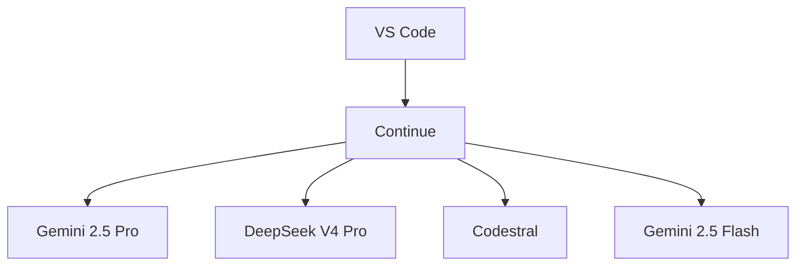

# Building My Personal AI Research Lab: A Comprehensive Guide

## Introduction

As a software engineer and researcher, I've spent months optimizing my AI research environment. This guide documents my journey in creating a powerful yet accessible setup using VS Code, Continue, and various AI models.

### Why Not Just Use One Model?

While many developers prefer a single AI model, I've found that using multiple models in specialized roles provides better results. Each model has unique strengths that complement each other in different aspects of research.

## Architecture Overview

My research environment consists of several key components:

1. **VS Code** as the primary IDE
2. **Continue** as the AI integration layer
3. **Gemini 2.5 Pro** for content generation
4. **DeepSeek V4 Pro** for technical validation
5. **Codestral** for code generation
6. **Gemini 2.5 Flash** for final editing



## Model Comparisons

### Gemini 2.5 Pro

**Strengths:**
- Excellent at generating technical content
- Strong understanding of software engineering concepts
- Good at creating structured documentation

**Weaknesses:**
- Can be verbose at times
- Sometimes struggles with very specific technical details

### DeepSeek V4 Pro

**Strengths:**
- Superior technical accuracy
- Better at code analysis and debugging
- More consistent with complex technical topics

**Weaknesses:**
- Less creative in content generation
- Can be more rigid in its responses

### Codestral

**Strengths:**
- Excellent code generation
- Good at creating configuration files
- Handles complex code structures well

**Weaknesses:**
- Less suited for non-coding tasks
- Can sometimes produce code that needs refinement

## Configuration Files

### config.yaml

```yaml
# AI Research Environment Configuration

# VS Code Settings
vscode:
  extensions:
    - ms-python.python
    - continue.continue
    - ms-toolsai.jupyter

# Continue Configuration
continue:
  models:
    - name: gemini-2.5-pro
      api_key: ${GEMINI_API_KEY}
    - name: deepseek-v4-pro
      api_key: ${DEEPSEEK_API_KEY}
    - name: codestral
      api_key: ${CODESTRAL_API_KEY}

# GitHub Actions
github_actions:
  workflows:
    - name: ai-validation
      trigger: pull_request
      steps:
        - uses: actions/checkout@v4
        - name: Run DeepSeek validation
          run: continue validate --model deepseek-v4-pro
```

### Continue Configuration

```yaml
# Continue Configuration

models:
  - id: gemini-2.5-pro
    name: "Gemini 2.5 Pro"
    api_base: "https://api.gemini.com/v1"
    api_key: "${GEMINI_API_KEY}"
    model: "gemini-2.5-pro"
    context_length: 8192
    temperature: 0.7

  - id: deepseek-v4-pro
    name: "DeepSeek V4 Pro"
    api_base: "https://api.deepseek.com/v1"
    api_key: "${DEEPSEEK_API_KEY}"
    model: "deepseek-v4-pro"
    context_length: 16384
    temperature: 0.3

  - id: codestral
    name: "Codestral"
    api_base: "https://api.codestral.com/v1"
    api_key: "${CODESTRAL_API_KEY}"
    model: "codestral"
    context_length: 4096
    temperature: 0.5
```

## Personal Recommendations

1. **For content creation**: Use Gemini 2.5 Pro
2. **For technical validation**: Use DeepSeek V4 Pro
3. **For code generation**: Use Codestral
4. **For final editing**: Use Gemini 2.5 Flash

## Conclusion

Building a personal AI research environment requires careful consideration of each component's strengths and weaknesses. My setup leverages multiple models to provide a comprehensive toolkit for research and development.

### Why This Approach Works

- **Specialization**: Each model is used where it excels
- **Complementarity**: Models work together to cover all aspects of research
- **Flexibility**: Easy to swap models based on specific needs

This multi-model approach has significantly improved my productivity and the quality of my research outputs.

## References

- [Gemini 2.5 Pro Documentation](https://gemini.google.com/docs)
- [DeepSeek V4 Pro Documentation](https://deepseek.com/docs)
- [Codestral Documentation](https://codestral.com/docs)
- [Continue Documentation](https://continue.dev/docs)

---
